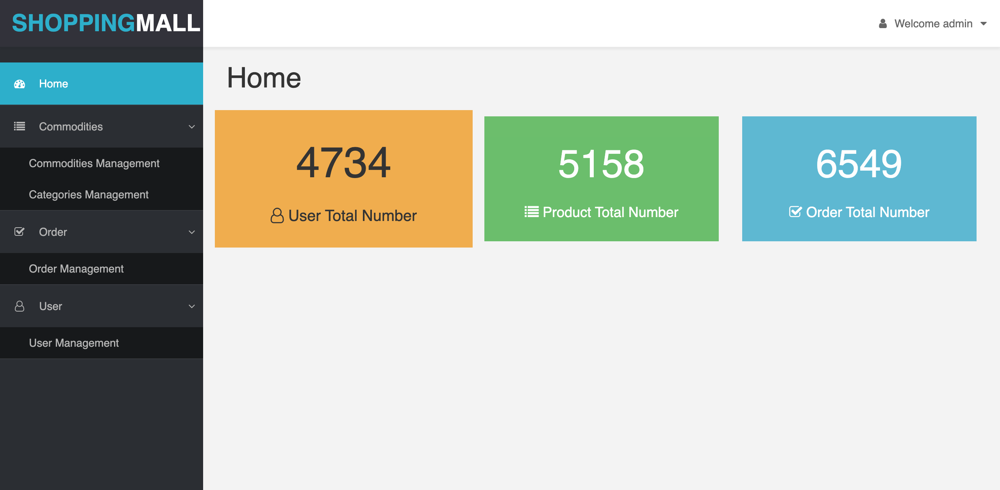

# shoppingMall

## introduction

This is a back stage of a shopping mall website. Administrative staffs can check many informations which includes Commodity, Category, Order and User. Moreover, they are able to publish their commodities and control the status of the commodities. For example, administrator can give an order that the current commodity is selling or off-shelf by changing the button states. Also, administrator can notify couriers to deliver the commodity if which order status of the commodity changed to paid.

**Website:** https://shopping-cms.herokuapp.com(To test the website, username: admin, password: admin)

## Description

This is a single page website structured with React, Router, Bootstrap, Sass and Webpack. All the APIs of shopping information are from third-party. There are many middleware included in this website such as 'http-proxy-middleware', 'pagination', 'fileupload', 'simditor' and so force.

## ScreenShots

<p align="center"></p>

## Deploy

Clone the application to your local directory first:
```javascript
git clone https://github.com/SmilingCode/shoppingMall.git
```

Install all necessary packages:
```javascript
npm install
```

Generate the application directory with webpack:
```javascript
npm run build
```

Launch the express server to serve our application
```javascript
npm run start
```

In the end, please visit localhost:8080 to browser the entire website.
